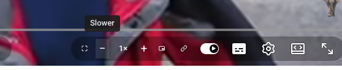
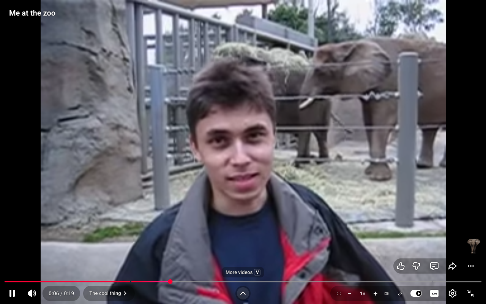
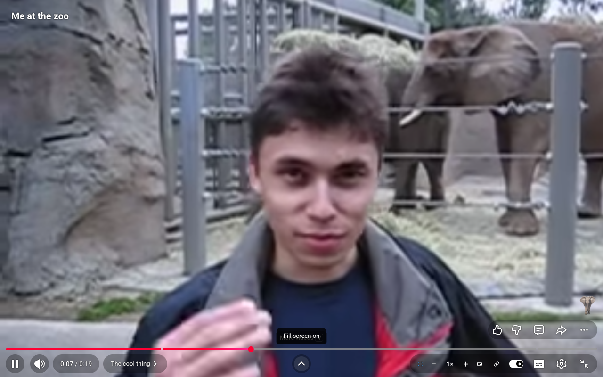
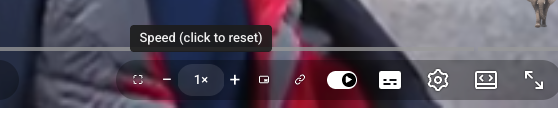

<p align="center">
  
</p>

<h1 align="center">YT Player Bar Controls</h1>

<p align="center">
  The four buttons YouTube forgot to put on the player bar:<br>
  <b>fill screen · speed stepper · picture in picture · copy clean link</b>
</p>

<p align="center">
  <a href="https://avirooppaul.github.io/yt-player-controls/">Landing page</a> ·
  <a href="https://github.com/AviroopPaul/yt-player-controls/releases/latest/download/yt-player-controls.zip">Download</a> ·
  <a href="#install">Install</a> ·
  <a href="#verified-against-real-youtube">Verification</a>
</p>



## What you get

1. **Fill screen**: one click zooms the video to eliminate black bars (letterbox or pillarbox). The zoom is computed from the exact player and video geometry, so it works for any aspect ratio in normal, theater, and fullscreen modes, and re-fits itself on resize or video change. The button glows blue while active.
2. **Speed stepper**: `−  1×  +` directly on the bar. Quarter steps from 0.25x to 3x (YouTube's own menu stops at 2x). Click the number to reset to 1x. The label stays in sync even if you change speed through YouTube's menu.
3. **Picture in picture**: one button, in and out.
4. **Copy link**: puts a clean `https://youtu.be/<id>` on your clipboard. No playlist junk, no tracking params.

Fill screen, before and after, on a 4:3 video in fullscreen:

| Fill off | Fill on |
| --- | --- |
|  |  |

Tooltips are custom and anchor to the visible glyph, so they sit exactly above what you point at, on every YouTube UI variant:



## Install

1. Download [yt-player-controls.zip](https://github.com/AviroopPaul/yt-player-controls/releases/latest/download/yt-player-controls.zip) and unzip it (or clone this repo).
2. Open `chrome://extensions` and enable **Developer mode** (top right).
3. Click **Load unpacked** and select the folder.
4. Open any YouTube video. The controls appear on the right side of the player bar.

## Verified against real YouTube

Every release is verified end to end with Playwright against a live YouTube video: a headed Chromium loads the extension, plays a 4:3 video (so fullscreen has real black bars to remove), and asserts all behavior including clipboard contents, PiP state, computed fill scale, and tooltip geometry. 21 checks, including an adversarial one that injects hostile page CSS to push a button glyph off-center and asserts the tooltip still tracks the glyph.

```sh
npm install
npx playwright install chromium
npm run verify
```

## How it works

- Manifest V3, content script only. No background process, no analytics, no data collection. The only permission is `clipboardWrite`.
- `content.js` injects the controls into `#movie_player .ytp-right-controls` and keeps them alive across YouTube's SPA navigation via a MutationObserver.
- Fill screen applies a CSS `transform: scale()` to the video element, computed as `max(playerW/videoW, playerH/videoH)`, and recomputes via ResizeObserver.
- Layout-critical styles are set inline and with `!important` because YouTube A/B tests player CSS per account, and tooltips anchor to the rendered glyph rect rather than the button box for the same reason.

## License

[MIT](LICENSE). Not affiliated with YouTube or Google.
